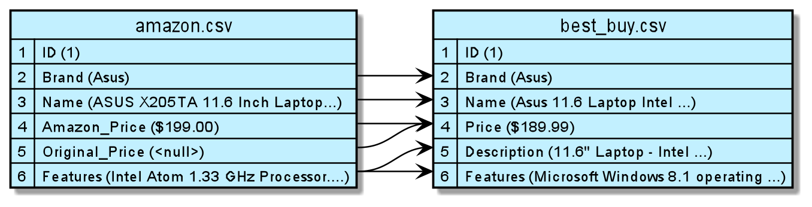
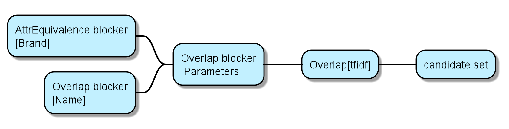

# Entity Matching with Magellan
This is a project for Sofia University.

Authors:
 - Kiril Dimov
 - Borislav Markov
 
## Introduction

Entity matching (EM) decides if disparate data pieces refer to the sam real-world entity. Many EM scenarios
exist. In this document we will only focus on the scenario of matching tuples between two tables. Specifically, given two tables A and B, we want to find all pairs of tuples (a, b), where tuple a is from A and tuple
b is from B and the two tuples refer to the same real-world entity. Next screen shows an example of such EM
scenarios.

Figure 1: An example of entity matching: given the two tables in (a) and (b), we want to find all tuple pairs
across the two tables that refer to the same real-world person; these pairs are called matches and are shown
in (c). Screen is taken from [1]

## The Process of Performing Entity Matching 
<sub><sup>Paragraph is copied from [1]</sup></sub>

In practice, EM is typically carried out in three stages:
* Requirement analysis: In this stage, we discuss with the business owner to understand the requirements for EM. Examples include using rule-based EM for understandability, having precision at least
95% and recall at least 80%, etc.
* Development: Recall that we want to match two tables A and B. In this stage, we will experiment
with data samples to develop an accurate EM workflow, one that satisfies the requirements in the
previous stage


Figure 2: The blocking and matching steps of an EM worklow. 
Screen is taken from [1]

Figure 3: Example workflows considered in this document.
Screen is taken from [1]
 
## Blocking and Matching
Before discussing the development stage, we discuss two fundamental steps of
a typical EM workflow: blocking and matching. Recall that our goal is to match two tables A and B. In
practice, these tables can be quite large, such as having 100K tuples each, resulting in 10 billions tuple pairs
across A and B. Trying to match all of these pairs is clearly very expensive. Thus, in such cases the user
often employs domain heuristics to quickly remove obviously non-matched pairs, in a step called blocking,
before matching the remaining pairs, in a step called matching.<sub><sup>Paragraph is copied from [1]</sup></sub>


Figure 4: Steps of the development 
Screen is taken from [1]

## Dataset
For dataset we chose a one from AnHai's group about electronics:
https://sites.google.com/site/anhaidgroup/useful-stuff/the-magellan-data-repository
ID:8


Example rows from  `amazon.csv`.


Example rows from  `best_buy.csv`.


Concrete columns and how they probably match.


We have downloaded the CSV and zipped files in here `dataset/dataset_electronics_ID_8.zip`

## Solution
We have developed 2 Jupyter notebooks, one for blocking and the other for matching.
See next section for running them. 

* [notebooks/entity_block_electronics.ipynb](notebooks/entity_block_electronics.ipynb)

* [notebooks/entity_match_electronics.ipynb](notebooks/entity_match_electronics.ipynb)

Blocking we do like on this screen:


For blocking we created 2 additional parameters: `Parameters`, which has only tokens with digits, which can be inch size,laptop, model, memory or processor.

The other field is called `tfidf` and contains 5 most important terms
```python
from sklearn.feature_extraction.text import TfidfVectorizer
import numpy as np
tf = TfidfVectorizer(input='content', analyzer='word', ngram_range=(1,1),
                      min_df = 0, stop_words = 'english', sublinear_tf=True)

# Fit A and B to be one big corpus of terms
tf.fit((A['Brand'] + ' ' + A['Name']).fillna(""))
tf.fit((B['Brand'] + ' ' + B['Name']).fillna(""))

# TFIDF for set A
tfidf_matrix =  tf.transform((A['Brand'] + ' ' + A['Name']).fillna(""))
feature_array = np.array(tf.get_feature_names())
def extract_top_tfidf(column):
     response = tf.transform([column])
     tfidf_sorting = np.argsort(response.toarray()).flatten()[::-1]
     n = 5
     top_n = feature_array[tfidf_sorting][:n]
     # stringify
     return " ".join(top_n)

A['tfidf'] = ((A['Brand'] + ' ' + A['Name']).fillna("")).apply(extract_top_tfidf)

B['tfidf'] = ((B['Brand'] + ' ' +B['Name']).fillna("")).apply(extract_top_tfidf)
```
Example of new fields:


For matching we added 2 new fields:

 * `Screen` which is the screen size in inches(extracted from text)
 * `Price_num` is price with stripped '$' and some other heuristics.

## Selecting the best learning-based matcher
Selecting the best learning-based matcher typically involves the following steps:

* Creating a set of learning-based matchers
* Creating features
* Converting the development set into feature vectors
* Selecting the best learning-based matcher using k-fold cross validation

```python
# Create a set of ML-matchers
dt = em.DTMatcher(name='DecisionTree', random_state=0)
svm = em.SVMMatcher(name='SVM', random_state=0)
rf = em.RFMatcher(name='RF', random_state=0)
lg = em.LogRegMatcher(name='LogReg', random_state=0)
ln = em.LinRegMatcher(name='LinReg')
```

## Selecting the Best Matcher Using Cross-validation
Now, we select the best matcher using k-fold cross-validation. For the purposes of this guide, we use five fold cross validation and use 'precision' and 'recall' metric to select the best matcher.

```python
# Select the best ML matcher using CV
result = em.select_matcher([dt, rf, svm, ln, lg], table=H, 
        exclude_attrs=['_id', 'ltable_ID', 'rtable_ID', 'label'],
        k=6,
        target_attr='label', metric_to_select_matcher='precision', random_state=0)
result['cv_stats']

```
The rest of the solution can be visible in the Jupyter notebook files.


## Installation
Install is done, following steps from here:
http://anhaidgroup.github.io/py_entitymatching/v0.3.x/user_manual/installation.html

`pip install -U numpy scipy py_entitymatching`
### Requirements
- Python 3.x
- Jupyter notebook
- Magellan Entity Matcher
- Other(inferred from Entity Matcher)
  * C Compiler Required (This is necessary because this package contains Cython files)
  * pandas (provides data structures to store and manage tables)
  * scikit-learn (provides implementations for common machine learning algorithms)
  * joblib (provides multiprocessing capabilities)
  * pyqt5 (provides tools to build GUIs)
  * py_stringsimjoin (provides implementations for string similarity joins)
  * py_stringmatching (provides a set of string tokenizers and string similarity functions)
  * cloudpickle (provides functions to serialize Python constructs)
  * pyprind (library to display progress indicators)
  * pyparsing (library to parse strings)
  * six (provides functions to write compatible code across Python 2 and 3)
  * xgboost (provides an implementation for xgboost classifier)
  * pandas-profiling (provides implementation for profiling pandas dataframe)
  * pandas-table (provides data exploration tool for pandas dataframe)
  * openrefine (provides data exploration tool for tables)
  * ipython (provides better tools for displaying tables in notebooks)
  * scipy (dependency for skikit-learn)

### Starting Jupyter notebook
Running a Jupyter notebook can be done in linux by checkout
this repository and running this command in the root directory:

`jupyter notebook --port=8181`

This will open a browser and show the parent folder. Navigate to folder `notebooks`.
In this folder you will see `entity_match_electronics.ipynb`. Click on it and it will
show the notebook.

## Literature and Sources

 [1] How-To Guide to Entity Matching, AnHai's Group, 2017 
https://pradap-www.cs.wisc.edu/magellan/how-to-guide/how_to_guide_magellan.pdf
 
 [2] User Manual for py_entitymatching, AnHai's Group, 2017 
http://anhaidgroup.github.io/py_entitymatching/v0.3.x/index.html

 [3] The 784 Data Sets for EM, students in the CS 784 data science class at UW-Madison, 2015
https://sites.google.com/site/anhaidgroup/useful-stuff/the-magellan-data-repository

 [4] tf–idf - Wikipedia
https://en.wikipedia.org/wiki/Tf%E2%80%93idf

 [5] API reference for Blockers, An Haim Group
http://anhaidgroup.github.io/py_entitymatching/v0.1.x/user_manual/api/blocking.html
